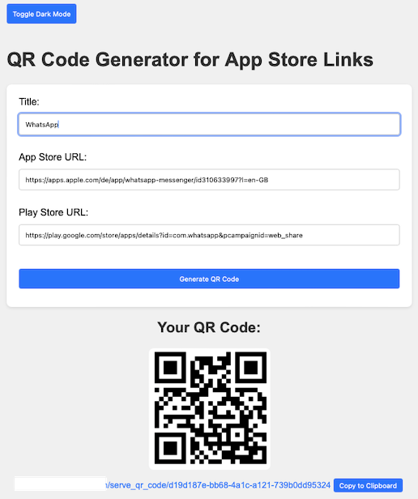
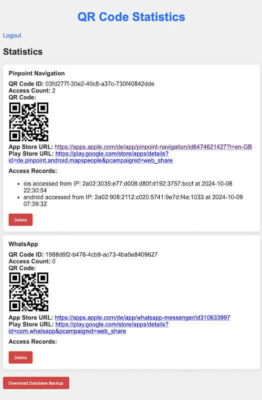

# AppLinkr

AppLinkr is a simple yet powerful web application that generates a QR code and forwards users to the appropriate App Store or Google Play Store based on their device type. With AppLinkr, you can easily share your mobile application links and track user interactions.




# Demo

Test out **AppLinkr** at [https://demo.applinkr.one](https://demo.applinkr.one)

Admin password: `applinkr-demo` 

## Features

- **QR Code Generation**: Generate a unique QR code for your app with a simple interface.
- **Device Detection**: Automatically redirects users to the appropriate app store based on their device (iOS or Android).
- **Tracking**: Monitor user interactions with each QR code, including access count and device type.
- **Admin Panel**: View statistics, manage QR codes, and download the database backup.

## Table of Contents

- [Installation](#installation)
- [Usage](#usage)
- [License](#license)
- [Contributing](#contributing)
- [Contact](#contact)

## Installation
### Installation via docker-compose

```yaml
version: '3.8'

services:
  applinkr:
    image: schech1/applinkr:latest
    ports:
      - "5001:5001"
    environment:
      PASSWORD: admin
      SERVER_URL: "https://qr.domain.com"
    volumes:
      - ./db:/app/db
```

## Usage
Navigate to your domain, to open the QR-Code-Generator.

Navigate to `/admin` to access the admin panel. Login with your defined password.

## License

This project is licensed under the MIT License. See the LICENSE file for more details.

## Contributing

### Help Wanted
I'm looking for someone with UI/UX-Experience to improve the design of the app. 
If you are interested to contribute, let me know.